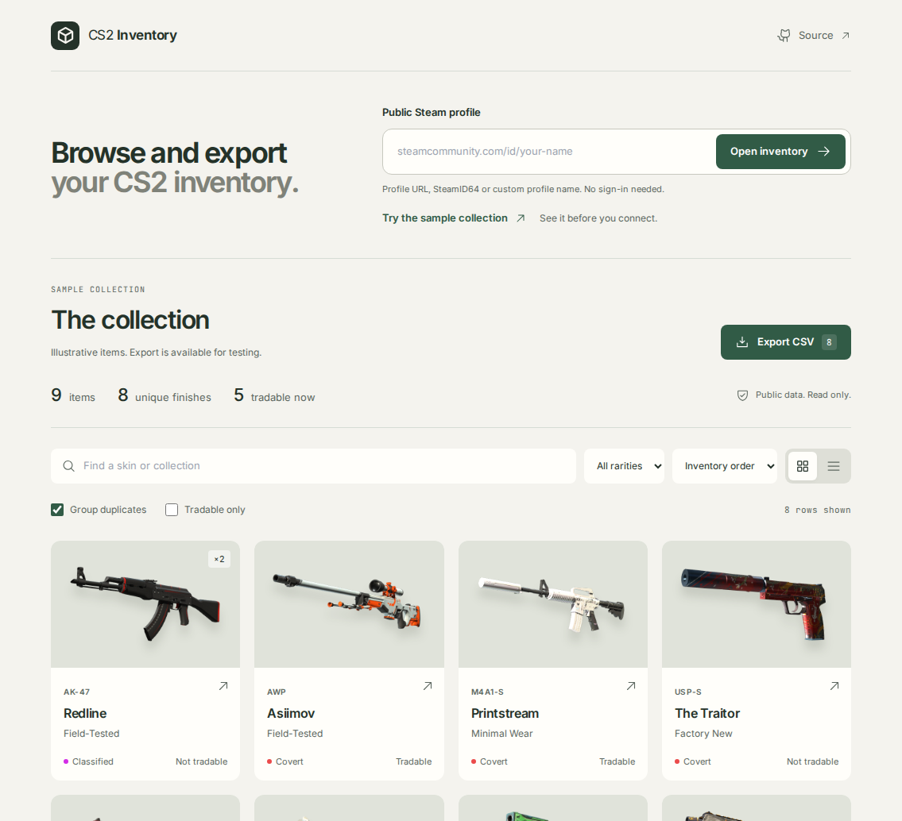

# CS2 Inventory Exporter

Export any public Counter-Strike 2 inventory to a CSV file, with item names, wear, rarity, collection and trade status.

**Live app:** https://cs2-inventory-exporter-auxo.vercel.app/



## Features

- **Accepts any profile format:** `steamcommunity.com/id/name` links, `/profiles/7656…` links, a bare SteamID64, or just the custom URL name.
- **Full item details:** market name, type, weapon, exterior, rarity, StatTrak™/Souvenir quality, collection, tradable and marketable flags, trade-hold date, asset IDs, a Steam Market link and an in-game inspect link.
- **Preview before you download:** search by name or collection, filter by rarity or tradability, sort by rarity, and group identical items. Rows are tinted with Steam's own rarity colours.
- **Spreadsheet-safe CSV:** UTF-8 with a byte-order mark so Excel shows ★ and ™ correctly. Cells that start with `=`, `+`, `-` or `@` are escaped so they can't run as formulas. You can download everything or only the filtered rows.
- **Clear errors:** private inventories come with instructions for making them public. Unknown profiles and Steam rate limits each get their own message.
- **No API key required.**

## How it works

`POST /api/get-inventory` with `{ "profile": "…" }`:

1. **Parse** the input into a SteamID64 or a custom URL name (`lib/steam.mjs → parseProfileInput`).
2. **Resolve** custom URLs through the public profile XML. If `STEAM_API_KEY` is set, it uses `ISteamUser/ResolveVanityURL` first.
3. **Fetch** `steamcommunity.com/inventory/{steamid}/730/2`, following `last_assetid` pagination 2,000 items at a time.
4. **Join** each asset to its description and flatten the result into one row per item.

Responses are cached in memory for two minutes to stay under Steam's rate limit. The CSV is built in the browser (`lib/csv.mjs`), so the preview and the download always match.

> **Why not the Steam Web API?** Earlier versions called `IEconItems_730/GetPlayerItems`. Valve has retired that endpoint for CS2 and it now answers `410 Gone`. It also only ever returned numeric definition indexes, not item names.

## Running locally

Requires Node.js 20.9 or newer.

```bash
npm install
npm run dev        # http://localhost:3000
npm test           # 8 tests, no network access needed
npm run lint
```

`STEAM_API_KEY` is optional. Copy `.env.example` to `.env.local` if you want to use it.

## Deploying

The live app runs on Vercel. To deploy your own copy, import the repository on [Vercel](https://vercel.com/new); no configuration is needed. Pushes to `main` redeploy automatically.

Steam rate-limits inventory requests per IP address, and shared hosting IPs hit that limit sooner. If users regularly see the rate-limit message, deploy to a platform with a dedicated outbound IP or add a longer-lived cache such as Vercel KV.

## Project layout

```
app/page.js                     the UI: form, preview table, filters, download
app/api/get-inventory/route.js  API route: validation, caching, error mapping
lib/steam.mjs                   input parsing, vanity lookup, paginated fetch, item mapping
lib/csv.mjs                     CSV columns and escaping
tests/steam.test.mjs            node:test suite with mocked Steam responses
```

## Limitations

- Only public inventories can be read. That is a Steam restriction.
- Prices are not included. Steam's price endpoint is heavily rate-limited and would make large inventories slow to export.
- Storage Unit contents are not visible through this endpoint.

Not affiliated with Valve Corporation or Steam.

## License

MIT © Harsh Raj
